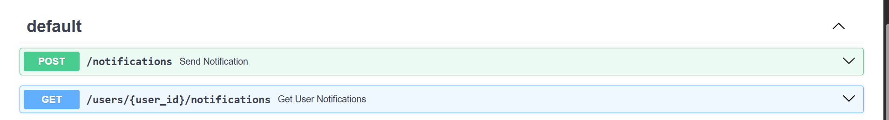
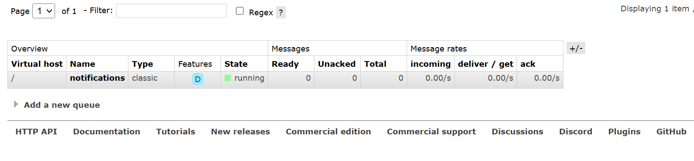

# Notification Service

## Overview

This project implements a **Notification Service** that allows sending notifications to users via Email, SMS, and In-App messages. The system is designed for scalability and reliability using a microservices approach, with FastAPI for the API layer and RabbitMQ as a message queue for asynchronous processing.

---

## Features

- **API Endpoints** (via FastAPI):
  - `POST /notifications`: Send a notification (Email, SMS, or In-App) to a user.
  - `GET /users/{id}/notifications`: Retrieve all in-app notifications for a user.

- **Notification Types**:
  - **Email**: Sent using SMTP (e.g., Gmail SMTP with App Password).
  - **SMS**: Sent using the Twilio Messaging Service.
  - **In-App**: Stored in a SQLite database using SQLAlchemy and retrievable via API.

- **Queue-Based Processing**:
  - Uses **RabbitMQ** to queue notification jobs for asynchronous processing.
  - Worker service consumes messages from the queue and processes notifications.
  - Implements retry logic for failed notifications (up to 3 attempts).

- **Dockerized**:
  - All services (API, worker, RabbitMQ) run in isolated containers using Docker Compose.

---

## Architecture


```
+-------------------+         +-------------------+         +-------------------+
|                   |         |                   |         |                   |
|    FastAPI API    +-------->+    RabbitMQ       +-------->+   Worker Service  |
|                   |         |   (Queue: notifications)    |                   |
+-------------------+         +-------------------+         +-------------------+
        |                                                          |
        |                                                          |
        |<------------------- In-App Notifications ---------------+
        |
+-------------------+
|                   |
|   SQLite DB       |
| (via SQLAlchemy)  |
|                   |
+-------------------+
```

- **FastAPI**: Handles HTTP requests and pushes notification jobs to RabbitMQ.
- **RabbitMQ**: Acts as a message broker (queue name: `notifications`). No custom exchange is used; the default direct exchange is utilized.
- **Worker**: Consumes messages from the queue, processes notifications, and handles retries.
- **Database**: Stores in-app notifications using SQLite and SQLAlchemy ORM.

---

## Implementation Details

- **Queue (RabbitMQ)**:
  - The queue named `notifications` is used for all notification jobs.
  - The default (direct) exchange is used for simplicity.
  - Durable queue ensures messages are not lost if RabbitMQ restarts.

- **FastAPI**:
  - Provides RESTful endpoints for sending and retrieving notifications.
  - Publishes notification jobs to RabbitMQ.

- **Worker**:
  - Listens to the `notifications` queue.
  - Processes each notification based on its type.
  - Retries failed notifications up to 3 times before marking as failed.
  - **Email notifications** are sent using SMTP (e.g., Gmail SMTP).
  - **SMS notifications** are sent using the Twilio Messaging Service.
  - **In-App notifications** are saved in a SQLite database using SQLAlchemy.

- **Database**:
  - Uses **SQLite** as the database engine for simplicity and local development.
  - **SQLAlchemy** is used as the ORM to interact with the database and manage in-app notifications.

---

## Screenshots

> _You can include screenshots of your API docs, RabbitMQ UI, or frontend here. Place images in an `images/` folder in your repo._

**Example:**





---

## Setup & Running the Project

### **Prerequisites**

- [Docker](https://www.docker.com/products/docker-desktop) and Docker Compose installed on your machine.

### **Environment Variables**

Create a `.env` file in the project root with the following variables (example):

```
DATABASE_URL=sqlite:///./test.db

# Email (Gmail SMTP with App Password)
EMAIL_HOST=smtp.gmail.com
EMAIL_PORT=587
EMAIL_USERNAME=your_email@gmail.com
EMAIL_PASSWORD=your_app_password

# Twilio
TWILIO_ACCOUNT_SID=your_account_sid
TWILIO_AUTH_TOKEN=your_auth_token
TWILIO_PHONE_NUMBER=your_twilio_number
TWILIO_MESSAGING_SERVICE_SID=your_messaging_service_sid
```

### **Running the Project**

1. **Clone the repository:**
   ```sh
   git clone <your-repo-link>
   cd notification_service
   ```

2. **Start all services using Docker Compose:**
   ```sh
   docker-compose up --build
   ```

   This will start:
   - FastAPI API server (on port 8000)
   - RabbitMQ (management UI on port 15672, default user/pass: guest/guest)
   - Worker service

3. **Access the API:**
   - Open [http://localhost:8000/docs](http://localhost:8000/docs) for interactive API documentation (Swagger UI).

4. **Access RabbitMQ Management UI:**
   - Open [http://localhost:15672](http://localhost:15672) (user: `guest`, pass: `guest`).

---

## API Endpoints

- **Send Notification**
  - `POST /notifications`
  - Body example:
    ```json
    {
      "type": "email", // or "sms" or "inapp"
      "to": "user@example.com",
      "message": "Hello!",
      "user_id": 1
    }
    ```

- **Get User Notifications**
  - `GET /users/{id}/notifications`

---

## Extending for Real Email/SMS

- **Email**:  
  The `send_email` function in `worker.py` uses SMTP (e.g., Gmail SMTP with App Password). You can use any SMTP provider by updating the `.env` file.

- **SMS**:  
  The `send_sms` function in `worker.py` uses the Twilio Messaging Service. Make sure your Twilio credentials and Messaging Service SID are set in `.env`.

---

## Assignment Requirements Checklist

- [x] **POST /notifications** endpoint
- [x] **GET /users/{id}/notifications** endpoint
- [x] **Email, SMS, and In-App notifications**
- [x] **Queue-based processing with RabbitMQ**
- [x] **Retries for failed notifications**
- [x] **Source code and setup instructions**
- [x] **API documentation via Swagger UI**
- [x] **SMTP for email, Twilio Messaging Service for SMS, SQLite+SQLAlchemy for in-app**

---

## Assumptions

- Email notifications are sent using SMTP (Gmail SMTP with App Password recommended).
- SMS notifications are sent using the Twilio Messaging Service.
- In-app notifications are stored in the SQLite database using SQLAlchemy.
- The system is designed for local development and testing using Docker Compose.

---

## Including Images in the README

To include images or screenshots, place them in an `images/` folder in your project and use Markdown syntax:

```markdown

```

---

## License

MIT License
